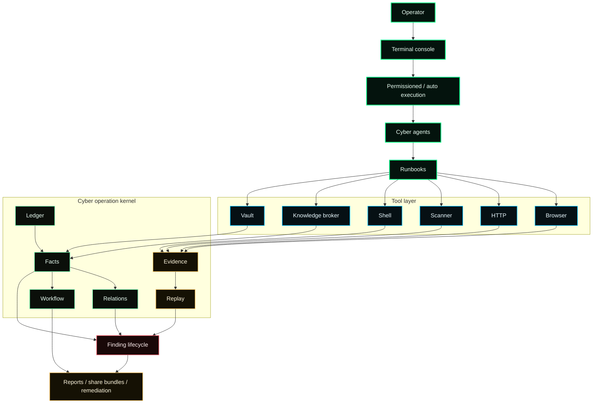
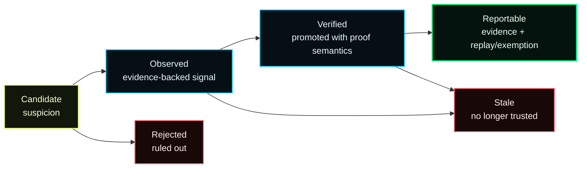

<h1 align="center">numasec</h1>

<p align="center">
  <b>The open source AI security agent.</b>
</p>

<p align="center">
  Give your terminal a security brain.
</p>

<p align="center">
  Run security workflows with your local tools, agents, runbooks, findings, evidence, replay and reports.
</p>

<p align="center">
  <code>npm install -g numasec</code>
</p>

<p align="center">
  <a href="https://github.com/FrancescoStabile/numasec/actions/workflows/ci.yml"></a>
  <a href="https://github.com/FrancescoStabile/numasec/releases"></a>
  <a href="https://www.npmjs.com/package/numasec"></a>
  <a href="https://www.npmjs.com/package/numasec"></a>
  <a href="https://github.com/FrancescoStabile/numasec/stargazers"></a>
  <a href="LICENSE"></a>
</p>

<p align="center">
  
</p>

<p align="center">
  <a href="#demo">Demo</a> |
  <a href="#why-numasec">Why</a> |
  <a href="#what-it-feels-like">What it feels like</a> |
  <a href="#try-it">Try it</a> |
  <a href="#what-it-does">What it does</a> |
  <a href="#commands">Commands</a> |
  <a href="#architecture">Architecture</a> |
  <a href="#roadmap">Roadmap</a>
</p>

---

## What is numasec?

numasec is an AI security agent that runs in your terminal.

It uses the tools already installed on your machine, follows security runbooks, switches between cyber agents, keeps the operation context alive, tracks findings, stores evidence and helps turn the work into reports.

It is built for people who already live between shell, browser, HTTP requests, scanners, advisories, notes and reports.

- Not a chatbot.
- Not a scanner wrapper.
- Not a Burp or Kali replacement.

A security agent for the workflow you already have.

## Demo

<p align="center">
  <a href="assets/demo.mp4">
    
  </a>
  <br />
  <sub>Click the preview for the full terminal recording.</sub>
</p>

## Why numasec

Security work does not happen in one clean place.

You move between terminal commands, browser work, HTTP requests, local tools, scanners, advisories, notes, screenshots, findings and reports.

AI can help, but only if it lives inside that workflow.

numasec gives the model a security workspace instead of just a chat box. It keeps the target, scope, tools, runbooks, findings, evidence, replay and report state together while the work is happening.

The goal is simple:

**make security work feel faster, sharper and less scattered.**

numasec is strongest today for authorized AppSec and Pentest workflows. Other cyber surfaces exist or are possible, but they are not marketed as equally mature yet.

## Why now

Coding agents changed how developers work.

They read code, run commands, edit files, execute tests and stay inside the development loop.

Security needs the same shift, but security work has different constraints.

A security agent needs to know the target, stay inside scope, use the local toolchain, remember what happened, separate noise from findings and keep enough context to produce useful output later.

That is what numasec is trying to become:

**the open source AI security agent for the terminal.**

## What it feels like

Open numasec inside the workspace you are testing, pick the right security agent, check which local tools are available, then start a runbook and let the agent help you move through the workflow.

When the work changes, switch posture. When something matters, keep the finding, evidence, replay and report context close to the operation instead of scattering it across shell history, screenshots and notes.

Then come back later and resume without starting from zero.

## Product tour

numasec starts like a terminal agent, then the security work begins, and it becomes a workspace.

<p align="center">
  
</p>

You get the model, the active agent, the command palette, the working directory and the prompt. The point is not to leave your terminal; the point is to make the terminal smarter.

<p align="center">
  
</p>

Findings are not dumped into chat: they live in the operation, where each one can carry state, severity, evidence, replay status and next action, so the agent can keep working without losing the thread.

Weak signals can stay weak. Rejected claims remain visible. Reportable findings need proof.

<p align="center">
  
</p>

Security work changes shape. AppSec, Pentest, OSINT, CTF/lab and research do not need the same posture, so you can switch the agent when the work changes instead of forcing one generic assistant to behave the same way everywhere.

<p align="center">
  
</p>

Operations are durable. Name them, rename them, resume them and export them. A security workflow should not disappear because the chat ended.

## Try it

```bash
npm install -g numasec
numasec
```

Then start with a local lab, CTF, owned app or authorized target:

```text
/doctor
/mode appsec
/runbook run appsec-web-triage http://localhost:3000
/share
```

Run numasec from the workspace you are testing and keep the target scope explicit.

## What it does

| Capability | What it gives you |
| --- | --- |
| **AI security agent** | A model that works inside your terminal instead of sitting in a separate chat window. |
| **Local tools** | numasec uses the tools installed on your machine and shows what is available, missing or degraded. |
| **Runbooks** | Security workflows that keep the agent moving through a real task instead of random tool calls. |
| **Agents** | Switch posture with TAB for AppSec, Pentest, OSINT, CTF/lab and research-style work. |
| **Operation memory** | Keep target, scope, activity, findings, evidence, replay and report state together. |
| **Findings workflow** | Track security signals as they move from weak ideas to useful findings. |
| **Evidence and replay** | Keep the material needed to understand, verify and reproduce important work. |
| **Cyber knowledge** | Bring vulnerability intelligence, advisories, methodology and tool docs into the workflow. |
| **Reports** | Generate deliverables from the operation instead of reconstructing everything at the end. |
| **Share bundles** | Export the work so it can be reviewed, resumed or handed off. |

## Built for

numasec is for people who want an AI agent inside their security workflow, not beside it.

- **AppSec engineers** triaging web apps, APIs, dependencies, auth flows and reports.
- **Pentesters** moving through scoped work with terminal tools, notes, evidence and deliverables.
- **Bug bounty hunters** who want to move faster without losing target context.
- **Security researchers** jumping between shell, browser, HTTP, advisories, tradecraft and notes.
- **CTF and lab users** who want structure while still keeping direct control of the tools.

numasec is for authorized security work. Use it only on systems you own, labs, CTFs, or targets where you have permission to test.

## How the workflow fits together

numasec is not just a prompt with tools.

It keeps the security workflow connected: target, operation, posture, runbook, local tools, observations, findings, evidence, replay and report.

```mermaid
flowchart LR
  target["Target"] --> operation["Operation"]
  operation --> posture["Scope + opsec + autonomy"]
  posture --> runbook["Runbook"]
  runbook --> tools["Local cyber tools"]

  tools --> evidence["Evidence"]
  evidence --> observations["Observations"]
  observations --> findings["Findings"]
  findings --> proof["Replay / proof"]
  proof --> report["Report"]

  operation -. source of truth .-> kernel["Cyber kernel"]
  kernel --> evidence
  kernel --> findings
  kernel --> report

  classDef primary fill:#04130d,stroke:#00ff88,color:#eafff4,stroke-width:2px;
  classDef secondary fill:#061014,stroke:#00c2ff,color:#eaf9ff,stroke-width:1.5px;
  classDef proofNode fill:#151104,stroke:#ffcc66,color:#fff7df,stroke-width:1.5px;
  classDef findingNode fill:#190808,stroke:#ff5f6d,color:#fff0f0,stroke-width:1.5px;

  class target,operation,posture,runbook,tools primary;
  class evidence,observations,kernel secondary;
  class proof,report proofNode;
  class findings findingNode;
```



The important part: the operation does not live only in chat. numasec keeps a durable record of the work so the agent can continue, the operator can review, and the report can come from what actually happened.

## How numasec is different

Most AI security tools fall into one of two traps: they only talk, or they only wrap tools. numasec tries to do something different: keep the workflow alive while the agent works.

| Compared with | What usually happens | What numasec does |
| --- | --- | --- |
| **Generic AI chats** | Good advice, but detached from the actual work. | Runs inside the terminal workflow with tools, memory and operation state. |
| **Generic coding agents** | Great for repos and tests, but not shaped around security work. | Adds security agents, runbooks, scope, findings, evidence, replay and reports. |
| **Scanner wrappers** | Fast output, weak context. | Turns tool output into part of a larger operation. |
| **Manual notes** | Flexible, but everything drifts apart. | Keeps findings, evidence, replay and reports connected. |
| **Tool servers** | Expose capabilities, but leave workflow and memory to the user. | Adds the security workflow around the tools. |

## Commands

numasec is designed to stay fast from the keyboard: start an operation, switch agents, run workflows, inspect tools, tighten opsec, export the work and come back later.

```text
/doctor                        inspect local tool readiness
/mode appsec                   switch to the AppSec agent
/mode pentest                  switch to the Pentest agent
/agents                        open the agent switcher
/runbook list                  show available security workflows
/runbook run appsec-web-triage <target>
/runbook run web-surface <target>
/operations                    inspect, rename, resume or switch operations
/opsec strict                  tighten operation boundaries
/models                        switch provider or model
/share                         export the active operation bundle
/remediate <observation_id>    turn an observation into remediation guidance
/pwn <target>                  create a scoped pentest operation for a target
```

## Install

### npm

```bash
npm install -g numasec
numasec
```

### Bun

```bash
bun add -g numasec
numasec
```

### Docker

```bash
docker run -it --rm -v "$PWD:/work" -w /work francescostabile/numasec:latest
```

### From source

```bash
git clone https://github.com/FrancescoStabile/numasec.git
cd numasec
bun install
cd packages/numasec
bun run build
```

## Tool surface

numasec does not try to replace your tools.

It gives the agent a controlled way to use and reason around the environment you already have: shell, files, browser, HTTP, scanners, evidence, reports, knowledge and workspace state.

The agent sees a small set of useful security surfaces:

- **terminal and files:** `bash`, `read`, `write`, `edit`, `apply_patch`, `grep`, `glob`
- **web and application testing:** `http_request`, `browser`, `scanner`, `appsec_probe`
- **operation control:** `runbook`, `pwn_bootstrap`, `scope`, `opsec`, `autonomy`, `identity`
- **proof workflow:** `evidence`, `observation`, `finding`, `report`, `share`, `remediate`
- **security intelligence:** `knowledge`, `methodology`, `cve`
- **environment:** `doctor`, `workspace`, `vault`, `net`, `crypto`, `analyze`

`knowledge` is the preferred cyber research surface. It routes vulnerability intelligence, package advisories, methodology, tradecraft, exploit signals and installed tool docs through one provenance-aware broker.

For observed components like `nginx 1.18.0`, `OpenSSH_8.2p1` or `npm:react@18.2.0`, it separates **possibility** from **applicability**, enriches with KEV/EPSS where available, and suggests safe next actions without turning intelligence into a finding.

`cve` remains as a compatibility alias for CVE-style lookup. New cyber research should use `knowledge`.

Local tools make numasec stronger. If these are installed, the agent can use or reason around them:

```bash
# Debian / Kali / Ubuntu
apt install nmap sqlmap ffuf gobuster nikto nuclei trivy checksec

# macOS
brew install nmap sqlmap ffuf gobuster nikto nuclei trivy checksec
```

Use `/doctor` to see what is available, degraded, or missing on the current machine.

## Models and providers

Bring the model you trust. numasec is model-agnostic and wraps the model you choose with a security workflow: terminal, tools, agents, runbooks, operation memory, findings, evidence and reports.

Supported provider families include OpenAI, Anthropic, Google, xAI, Bedrock, OpenRouter, Ollama, Vercel AI Gateway, OpenAI-compatible endpoints, and other providers supported through the local model stack.

The bet is not that one model magically solves security. The bet is that good models become much more useful when they work inside the right security environment.

## Architecture

numasec wraps the model with a security workflow. The model can reason and act; numasec keeps the operation around it: tools, runbooks, events, facts, evidence, replay, findings and deliverables.



### Operation memory

An operation is stored as events, facts, relations, evidence, replay artifacts, workflow state and deliverables.

`numasec.md` can exist as a derived context pack. It helps orient the model, but it is not the source of truth.

### Finding lifecycle

Security work has messy intermediate states. Something can look interesting without being true. Something can be observed without being ready for a report. Something can be verified and later become stale.

numasec keeps those states visible instead of flattening everything into chat output.



The model is allowed to explore. The workflow is not allowed to pretend every idea is a finding.

### Runbooks instead of random tool spam

Security agents get noisy when they can call tools without a workflow. numasec uses runbooks to keep the agent moving through a recognizable task shape: surface mapping, AppSec triage, scoped pentest work and future domain-specific workflows.

Strongest today:

- `appsec-web-triage`
- `web-surface`
- `pwn` / Pentest starter flow

Maturity-labeled surfaces:

- repository AppSec triage
- API and auth surface work
- network surface work
- OSINT target work
- CTF and lab workflows
- cloud, container, IaC and binary triage

## Built to avoid AI security slop

numasec is built around a simple rule: **the agent can help you move faster, but the workflow should not let it overclaim.**

That is why numasec tracks scope, operation state, findings, evidence, replay and report output.

Mature focus:

- AppSec
- Pentest

Other cyber surfaces exist or are planned, but they are not marketed as equally mature yet.

numasec does not claim to replace authorization, operator judgment, manual review or specialized tools.

That honesty is not marketing modesty. It is part of the product. Security tools lose trust when they confuse confidence with proof.

## Roadmap

The long-term vision is simple:

**an open source AI security agent that can grow with the community.**

Short term, numasec is staying focused:

- better AppSec workflows
- better Pentest workflows
- stronger local tool adapters
- better evidence and replay capture
- cleaner report generation
- more useful agents
- better operation sharing
- clearer maturity labels

Longer term:

- OSINT workflows with provenance
- CTF and lab workflows
- cloud, container and IaC triage
- team operations
- review and handoff
- richer knowledge packs
- community runbooks

The rule stays the same: every mature domain needs real workflow support, not just a prompt.

## Documentation

- [Operations](docs/OPERATIONS.md)
- [Tool reference](docs/TOOLS.md)
- [Operation file format](docs/NUMASEC_FILE_FORMAT.md)
- [Changelog](CHANGELOG.md)
- [Contributing](CONTRIBUTING.md)
- [Security](SECURITY.md)

## Development

```bash
bun install
bun typecheck

cd packages/numasec
bun test --timeout 30000
bun run build
```

AppSec and Pentest benchmarks are local/manual release-confidence tools:

```bash
cd packages/numasec
bun run bench:cyber --domain appsec
bun run bench:cyber --domain pentest
```

Do not run package tests from the repo root. numasec uses Bun-first package-local workflows.

## Contributing

The most valuable contributions make numasec a better operator:

- runbooks with clear scope and proof semantics;
- parsers that turn tool output into provenance-backed facts;
- adapters for real security tools;
- benchmark scenarios that are hard to fake;
- report templates that reduce overclaiming;
- TUI polish that makes operations easier to read under pressure.

If a change creates a confirmed security claim, it needs evidence. If a finding is reportable, it needs replay or a structured exemption.

## Community

The best feedback is not "cool project".

The best feedback is:

- I tried it on this kind of authorized workflow
- this part made me faster
- this part got in my way
- this tool should be better supported
- this runbook should exist
- this finding flow felt wrong
- this report output was useful or useless

Use GitHub issues and discussions for bugs, workflow feedback, runbook ideas, adapters and release questions.

Please keep examples authorized, lab-based or safely anonymized.

## Help shape numasec

numasec is early, but the direction is clear:

**make security work feel faster, sharper and less scattered with an AI agent that lives in the terminal.**

If that feels useful, star the repo, try it on an authorized workflow and tell me where it breaks.

## License

[MIT](./LICENSE). Use numasec for authorized security work, research, education, and defensive operations.

<p align="center">
  Built by <a href="https://www.linkedin.com/in/francesco-stabile-dev">Francesco Stabile</a>
  | <a href="https://x.com/Francesco_Sta">@Francesco_Sta</a>
  <br/><sub>If numasec helps you, <a href="https://github.com/FrancescoStabile/numasec/stargazers">drop a star</a> and share the workflow.</sub>
</p>
